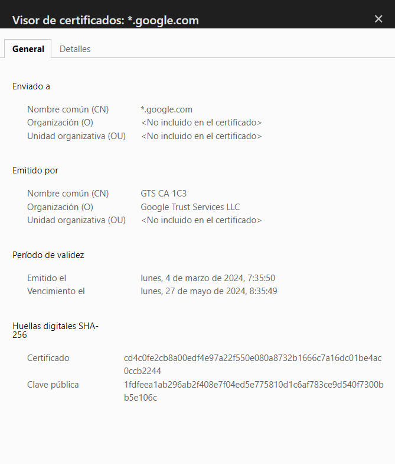

# Comparativa de certificado autofirmado y otros certificados
## Via simulada
### En la máquina virtual usada en la parte 1, instala un servidor web y prepáralo para servir una página de prueba. Genera un certificado autofirmado y configura HTTPS. Obtén una captura del error que proporciona el navegador y otra de los datos de tu certificado en el mismo.

Se procede a instalar el servicio de Apache2, y acto seguido, se empleará la página por defecto para efectuar las pruebas de SSL. Entonces, se genera nuestro autocertificado y se modifica el archivo default-ssl.conf que está localizado en el /etc/apache2/sites-enabled ; para poder meter la ruta del certificado.

Acto seguido, se hace una prueba para poder verificar su instalación, además de sus datos si comprobamos el certificado:

Sin embargo, podemos ver una gran diferencia con respecto a cuando entramos por primera vez en google.com, pudiendo recabar muchos más datos del certificado en comparación al autocertificado:

En definitiva, se puede descubrir que los certificados que no han sido autocertificados, contienen muchísima más información en comparación.
