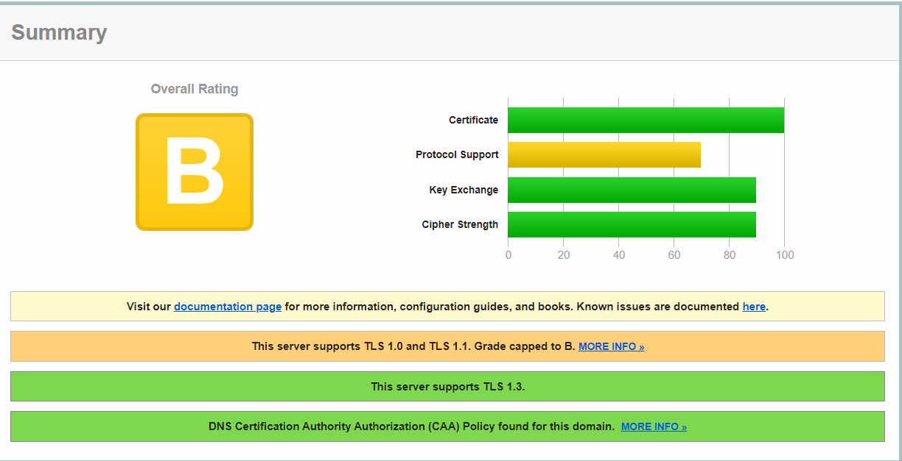
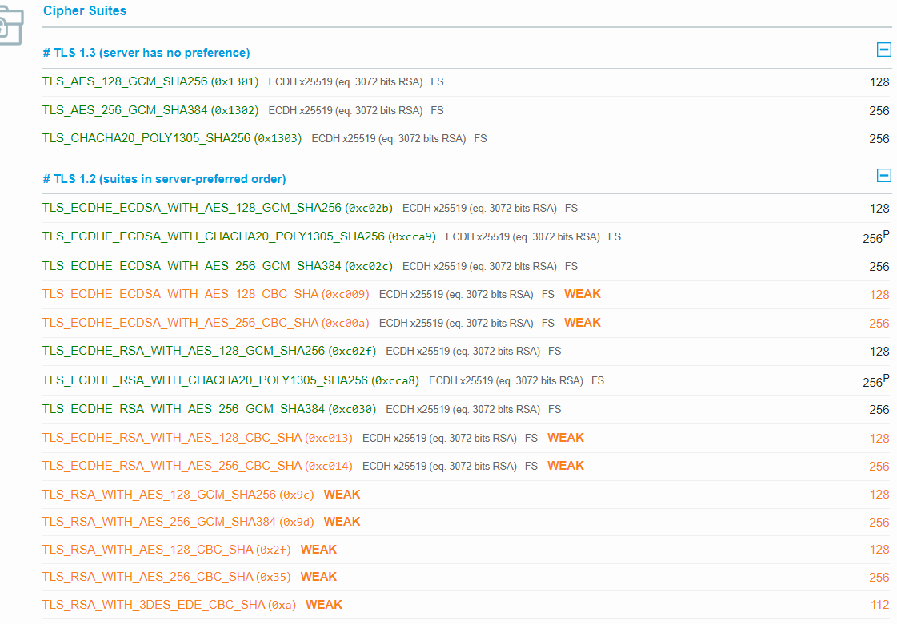
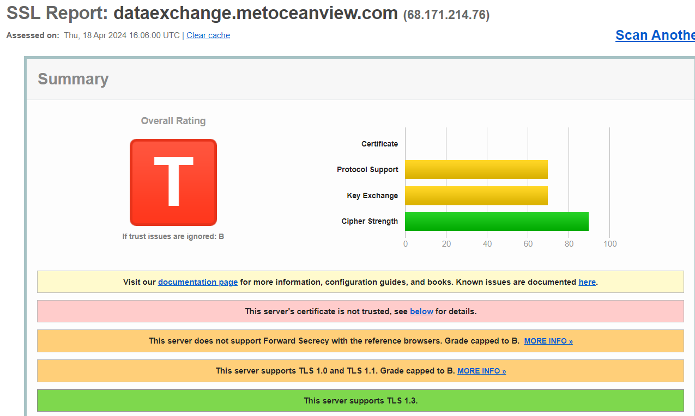
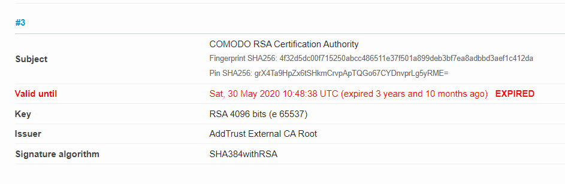
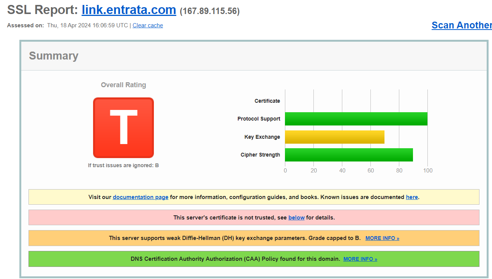
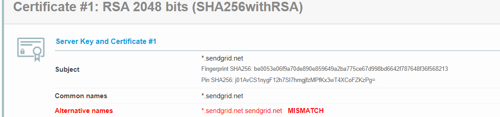
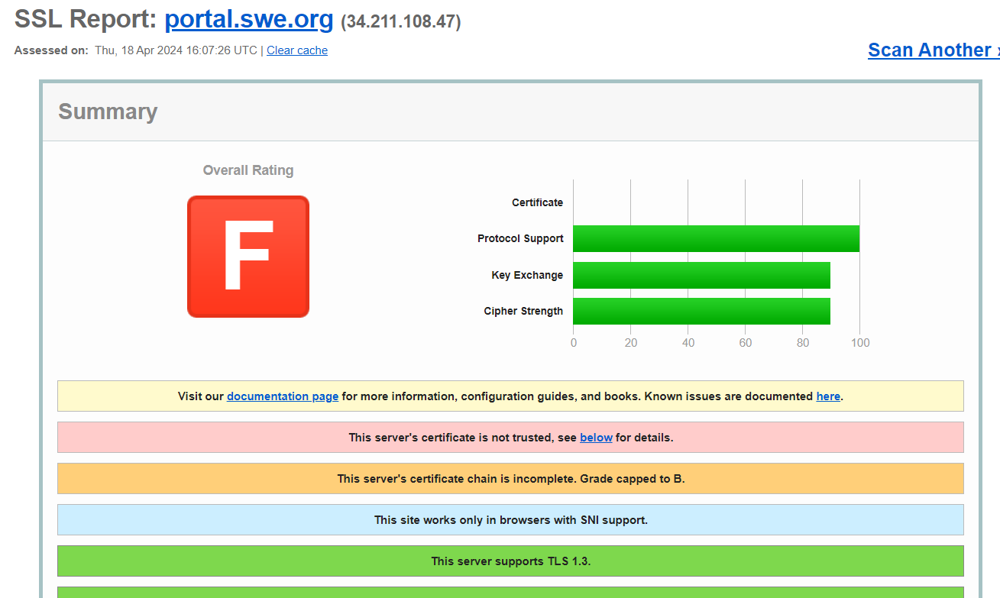
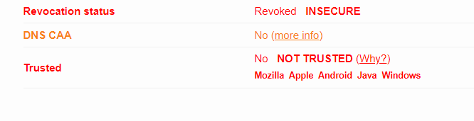

# Parte 3
## Analiza el certificado válido del sitio web de la parte 2 en un servicio como SSL Labs y explica, en base a los resultados, los motivos que llevan a verificarlo como válido. Luego, localiza tres certificados erróneos de diferente tipo en sitios web. Analízalos también usando un servicio y explica los motivos que llevan a verificarlos como no válidos.

Podemos pasar a comprobar de inicio, el cómo el certificado de www.google.com es confiable:

Sin embargo, en los siguientes podemos comprobar como hay numerosos errores, empezando con un error consistente en que el certificado no fue renovado desde el 2020, haciendo que esté caducado y vulnerable:

En este otro certificado, podemos comprobar como los nombres alternativos hacen conflicto entre si, no garantizando la viabilidad del certificado:

Y terminamos con este certificado, en el cual podemos ver que se revocó el certificado de manera manual, haciendo que esté insegura la página al no tener uno activo:

